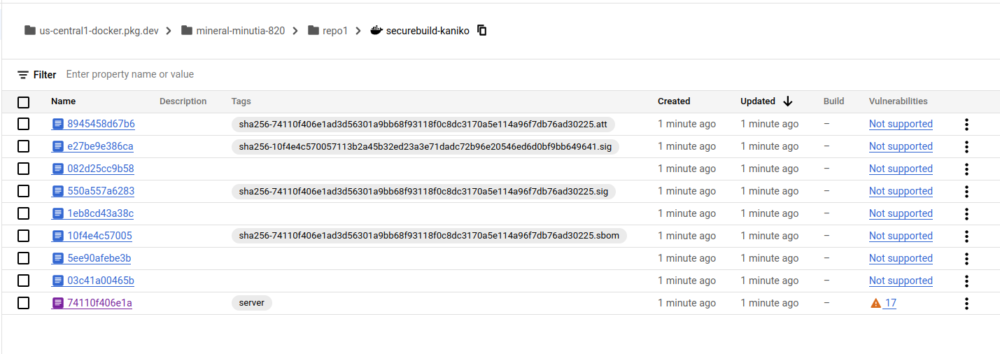

# Deterministic container hashes and container signing using Cosign, Kaniko and Google Cloud Build

A simple tutorial that generates consistent container image hashes using `kankko` and then signs provenance records using [cosign](https://github.com/sigstore/cosign) (Container Signing, Verification and Storage in an OCI registry).


this is identical to [Deterministic container hashes and container signing using Cosign, Bazel and Google Cloud Build](https://github.com/salrashid123/cosign_bazel_cloud_build) except ofcourse it uses [kaniko](https://github.com/GoogleContainerTools/kaniko) and its flag that enabled reproduceability:


- [Flag reproducible](https://github.com/GoogleContainerTools/kaniko#flag---reproducible)

```
--reproducible

Set this flag to strip timestamps out of the built image and make it reproducible.
```

This will create a consistent image hash:

* `securebuild-kaniko@sha256:bf03a87c3e4559442a810d9cbd734c16b0f5e4f180dc0ace2e58fe7351d842b1`

In this tutorial, we will:

1. generate a deterministic container image hash using  `kaniko`
2. use `cosign` to create provenance records for this image
3. use `syft` to generate the container `sbom`
4. use cosign to sign the container sbom
5. verify attestations and signatures using `KMS` and `OIDC` cross checked with a public transparency log.
6. use `syft` to generate the application `sbom`
7. sign the application `sbom` with cosign

I'm skipping explaining most of the steps that show usage of `cosign` and `syft`.  For those please see the `bazel` examples


We will use GCP-centric services here such as `Artifact Registry`, `Cloud BUild`, `Cloud Source Repository`.  

Both `KMS` and `OIDC` based signatures are used and for `OIDC`, an entry is submitted to a `transparency log` such that it can get verified by anyone at anytime.

>> **NOTE** Please be aware that if you run this tutorial, the GCP service_accounts _email_ you use to sign the artifacts within cloud build will be submitted to a public transparency log.  I used a disposable GCP project but even if i didn't, its just the email address and projectID in the cert, no big deal to me.  If it is to you, you can use the KMS examples and skip OIDC

>> this repo is not supported by google and employs as much as i know about it on 9/24/22 (with one weeks' experience with this..so take it with a grain of salt)

---

##### References:

* [SigStore](https://docs.sigstore.dev/)
* [cosign](https://github.com/sigstore/cosign)
* [Introducing sigstore: Easy Code Signing & Verification for Supply Chain Integrity](https://security.googleblog.com/2021/03/introducing-sigstore-easy-code-signing.html)
* [Best Practices for Supply Chain Security](https://dlorenc.medium.com/policy-and-attestations-89650fd6f4fa)
* [Deterministic builds with go + bazel + grpc + docker](https://github.com/salrashid123/go-grpc-bazel-docker)
* [in-toto attestation](https://docs.sigstore.dev/cosign/attestation/)
* [Notary V2 and Cosign](https://dlorenc.medium.com/notary-v2-and-cosign-b816658f044d)

---


### Setup

The following steps will use Google Cloud services 

* Cloud Source Repository to hold the code and trigger builds (you can use github but thats out of scope here),
* Cloud Build to create the image to save to artifact registry.
* Artifact Registry to hold the containers images

You'll also need to install [cosign](https://docs.sigstore.dev/cosign/installation/) (duh), and [rekor-cli](https://docs.sigstore.dev/rekor/installation), `git`, `gcloud`, optionally `gcloud`, `docker`.

```bash
export GCLOUD_USER=`gcloud config get-value core/account`
export PROJECT_ID=`gcloud config get-value core/project`
export PROJECT_NUMBER=`gcloud projects describe $PROJECT_ID --format='value(projectNumber)'`
echo $PROJECT_ID

## the projectID i used for this demo is PROJECT_ID=cosign-test-kaniko-1

gcloud auth application-default login

# enable services
gcloud services enable \
    artifactregistry.googleapis.com \
    cloudbuild.googleapis.com cloudkms.googleapis.com \
    iam.googleapis.com sourcerepo.googleapis.com

# create artifact registry
gcloud artifacts repositories create repo1 --repository-format=docker --location=us-central1

# create service account that cloud build will run as.
gcloud iam service-accounts create cosign

# allow 'self impersonation' for cloud build service account
gcloud iam service-accounts add-iam-policy-binding cosign@$PROJECT_ID.iam.gserviceaccount.com \
    --role roles/iam.serviceAccountTokenCreator \
    --member "serviceAccount:cosign@$PROJECT_ID.iam.gserviceaccount.com"

# allow cloud build to write logs
gcloud projects add-iam-policy-binding $PROJECT_ID \
  --member=serviceAccount:cosign@$PROJECT_ID.iam.gserviceaccount.com  \
  --role=roles/logging.logWriter

# allow cloud build write access to artifact registry
gcloud artifacts repositories add-iam-policy-binding repo1 \
    --location=us-central1  \
    --member=serviceAccount:cosign@$PROJECT_ID.iam.gserviceaccount.com \
    --role=roles/artifactregistry.writer

# allow cloud build access to list KMS keys
gcloud projects add-iam-policy-binding $PROJECT_ID \
  --member=serviceAccount:cosign@$PROJECT_ID.iam.gserviceaccount.com  \
  --role=roles/cloudkms.viewer


# create kms keyring and key
gcloud kms keyrings create cosignkr --location=global

gcloud kms keys create key1 --keyring=cosignkr \
 --location=global --purpose=asymmetric-signing \
 --default-algorithm=ec-sign-p256-sha256

gcloud kms keys list  --keyring=cosignkr --location=global

# allow cloud buildaccess to sign the key
gcloud kms keys add-iam-policy-binding key1 \
    --keyring=cosignkr --location=global \
    --member=serviceAccount:cosign@$PROJECT_ID.iam.gserviceaccount.com \
    --role=roles/cloudkms.signer

# allow current gcloud user to view the public key
gcloud kms keys add-iam-policy-binding key1 \
    --keyring=cosignkr --location=global \
    --member=serviceAccount:cosign@$PROJECT_ID.iam.gserviceaccount.com  \
    --role=roles/cloudkms.publicKeyViewer

# create a temp bucket for cloud build and allow cloud build permissions to use it
gsutil mb gs://$PROJECT_ID\_cloudbuild
gsutil iam ch serviceAccount:cosign@$PROJECT_ID.iam.gserviceaccount.com:objectAdmin gs://$PROJECT_ID\_cloudbuild
```

### Build image

```bash
# cd /app
gcloud beta builds submit --config=cloudbuild.yaml --machine-type=n1-highcpu-32

# optionally create the application sbom and sign it with the same cosign keypair
# goreleaser release --snapshot  --rm-dist 
## for github
## git tag v1.0.0
## git push origin --tags
## goreleaser release --rm-dist
```



### Verify

We are now ready to verify the images locally and using `cosign`


#### KMS

For kms keys, verify by either downloading kms public key

```bash
cd ../
gcloud kms keys versions get-public-key 1  \
  --key=key1 --keyring=cosignkr \
  --location=global --output-file=kms_pub.pem


# verify using the local key 
cosign verify --key kms_pub.pem   \
   us-central1-docker.pkg.dev/$PROJECT_ID/repo1/securebuild@sha256:bf03a87c3e4559442a810d9cbd734c16b0f5e4f180dc0ace2e58fe7351d842b1  | jq '.'

# or by api
cosign verify --key gcpkms://projects/$PROJECT_ID/locations/global/keyRings/cosignkr/cryptoKeys/key1/cryptoKeyVersions/1 \
      us-central1-docker.pkg.dev/$PROJECT_ID/repo1/securebuild@sha256:bf03a87c3e4559442a810d9cbd734c16b0f5e4f180dc0ace2e58fe7351d842b1 | jq '.'

Verification for us-central1-docker.pkg.dev/cosign-test-kaniko-1/repo1/securebuild@sha256:bf03a87c3e4559442a810d9cbd734c16b0f5e4f180dc0ace2e58fe7351d842b1 --
The following checks were performed on each of these signatures:
  - The cosign claims were validated
  - The signatures were verified against the specified public key
[
  {
    "critical": {
      "identity": {
        "docker-reference": "us-central1-docker.pkg.dev/cosign-test-kaniko-1/repo1/securebuild"
      },
      "image": {
        "docker-manifest-digest": "sha256:bf03a87c3e4559442a810d9cbd734c16b0f5e4f180dc0ace2e58fe7351d842b1"
      },
      "type": "cosign container image signature"
    },
    "optional": {
      "key1": "value1"
    }
  }
]


COSIGN_EXPERIMENTAL=1  cosign verify  us-central1-docker.pkg.dev/$PROJECT_ID/repo1/securebuild@sha256:bf03a87c3e4559442a810d9cbd734c16b0f5e4f180dc0ace2e58fe7351d842b1 | jq '.'


rekor-cli search --rekor_server https://rekor.sigstore.dev \
   --sha  05066f8e20a18df98be5050789b8935891908a921e3aabeed2d0378f1c236d88

## note, ifyou wanted to use the project ID is used in this repo to upload to rekor, set export PROJECT_ID=cosign-test-kaniko
rekor-cli search --rekor_server https://rekor.sigstore.dev  --email cosign@$PROJECT_ID.iam.gserviceaccount.com

Found matching entries (listed by UUID):
24296fb24b8ad77a868630095549dbe5dcbae06f9f447ba0c7817908ce1d782c93a4440226e15e29
24296fb24b8ad77abac2456499de9294a85a697e4ef17ae8d2693aa6b7e875f89745044385131e1c
24296fb24b8ad77af174e0898b660977bf7edcd85e714b120e158ee7ce7d144b9500de5602665516
```


custom predicate

```bash
rekor-cli get --rekor_server https://rekor.sigstore.dev \
   --uuid 24296fb24b8ad77a868630095549dbe5dcbae06f9f447ba0c7817908ce1d782c93a4440226e15e29

LogID: c0d23d6ad406973f9559f3ba2d1ca01f84147d8ffc5b8445c224f98b9591801d
Attestation: {"_type":"https://in-toto.io/Statement/v0.1","predicateType":"cosign.sigstore.dev/attestation/v1","subject":[{"name":"us-central1-docker.pkg.dev/cosign-test-kaniko-1/repo1/securebuild","digest":{"sha256":"bf03a87c3e4559442a810d9cbd734c16b0f5e4f180dc0ace2e58fe7351d842b1"}}],"predicate":{"Data":"{ \"projectid\": \"cosign-test-kaniko-1\", \"buildid\": \"a08b8033-3a26-4c5e-8d80-73ca3238ddbe\", \"foo\":\"bar\", \"commitsha\": \"fc9286ba352fd0207dbf3d3bc0bad0198ab5d9ec\", \"name_hash\": \"$(cat /workspace/name_hash.txt)\"}","Timestamp":"2023-04-22T19:56:23Z"}}
Index: 18669807
IntegratedTime: 2023-04-22T19:56:23Z
UUID: 24296fb24b8ad77a868630095549dbe5dcbae06f9f447ba0c7817908ce1d782c93a4440226e15e29
Body: {
  "IntotoObj": {
    "content": {
      "hash": {
        "algorithm": "sha256",
        "value": "26a8ce09dac3d10b1834a4ef9294117ce666296501e0b5d14c28ce84addeec70"
      },
      "payloadHash": {
        "algorithm": "sha256",
        "value": "42d5f6c4712031e0b09f0004e2ead28458717b3db1ae77745a0d5bc5c6b36b7d"
      }
    },
    "publicKey": "LS0tLS1CRUdJTiBDRVJUSUZJQ0FURS0tLS0tCk1JSUM3VENDQW5PZ0F3SUJBZ0lVUGJwQTZCM1JnNUdSRTR5OVkzNlNXaXB2ZnZzd0NnWUlLb1pJemowRUF3TXcKTnpFVk1CTUdBMVVFQ2hNTWMybG5jM1J2Y21VdVpHVjJNUjR3SEFZRFZRUURFeFZ6YVdkemRHOXlaUzFwYm5SbApjbTFsWkdsaGRHVXdIaGNOTWpNd05ESXlNVGsxTmpJeldoY05Nak13TkRJeU1qQXdOakl6V2pBQU1Ga3dFd1lICktvWkl6ajBDQVFZSUtvWkl6ajBEQVFjRFFnQUV1STlDeEVxNUZ3WmpIYWliK3VMbTkyYitVdXZTREVTc1ZaVDEKOE9OdHd3UlpvZjlBY3N5TkpYT2RZMGt3aS94YkdFbmIyM1ljVnJqanplZVRnMFV3V3FPQ0FaSXdnZ0dPTUE0RwpBMVVkRHdFQi93UUVBd0lIZ0RBVEJnTlZIU1VFRERBS0JnZ3JCZ0VGQlFjREF6QWRCZ05WSFE0RUZnUVVET2dHCkJOaHp1SWhIT1dpL1RUYXA0bGhiYms4d0h3WURWUjBqQkJnd0ZvQVUzOVBwejFZa0VaYjVxTmpwS0ZXaXhpNFkKWkQ4d1FRWURWUjBSQVFIL0JEY3dOWUV6WTI5emFXZHVRR052YzJsbmJpMTBaWE4wTFd0aGJtbHJieTB4TG1saApiUzVuYzJWeWRtbGpaV0ZqWTI5MWJuUXVZMjl0TUNrR0Npc0dBUVFCZzc4d0FRRUVHMmgwZEhCek9pOHZZV05qCmIzVnVkSE11WjI5dloyeGxMbU52YlRBckJnb3JCZ0VFQVlPL01BRUlCQjBNRzJoMGRIQnpPaTh2WVdOamIzVnUKZEhNdVoyOXZaMnhsTG1OdmJUQ0Jpd1lLS3dZQkJBSFdlUUlFQWdSOUJIc0FlUUIzQU4wOU1Hckd4eEV5WXhrZQpISmxuTndLaVNsNjQzanl0LzRlS2NvQXZLZTZPQUFBQmg2cUtBQlFBQUFRREFFZ3dSZ0loQUxFWDdWbC8xNEhGCkcvcEx5QWpHNjNRZHR0YWtqVHZBQk1DVS9RVEdidzlxQWlFQTFoVEFHRzZ6WUg5dmo0SXJLVzZlODk2c1FVdHoKTURtb05ZVVVEbEpKekxvd0NnWUlLb1pJemowRUF3TURhQUF3WlFJd0cvT2ZPYmFkT1paNEZmNFJnbFJxZU53cQpzczh3dldma0p5a3hMdldYRTk4cS9YcVVmUTJRcFA3MENvdnZLR2kzQWpFQXArYStnSXdCK01oSzJrbkpCZm5ZCm11NEFmR1RzeGhZZmlCeFdrMHdUTmNaMmo5YU9KNFk3cjlUZXV5RXVSeTRpCi0tLS0tRU5EIENFUlRJRklDQVRFLS0tLS0K"
  }
}
```

```bash
rekor-cli get --rekor_server https://rekor.sigstore.dev \
   --uuid 24296fb24b8ad77abac2456499de9294a85a697e4ef17ae8d2693aa6b7e875f89745044385131e1c     

LogID: c0d23d6ad406973f9559f3ba2d1ca01f84147d8ffc5b8445c224f98b9591801d
Index: 18669804
IntegratedTime: 2023-04-22T19:56:21Z
UUID: 24296fb24b8ad77abac2456499de9294a85a697e4ef17ae8d2693aa6b7e875f89745044385131e1c
Body: {
  "HashedRekordObj": {
    "data": {
      "hash": {
        "algorithm": "sha256",
        "value": "3bd4831711b3e3153576b2346a57a5ceba140ae3188c85e864b726efd1eff0ee"
      }
    },
    "signature": {
      "content": "MEUCIQC4PoWR3h1QA0NMe8CinRPfeqUQdURbd8MH+wBo5jH+SwIgd9uRpFJZ3QyUSpHslVrnnWBL0+Bk/B6roi4Z6gA/fGM=",
      "publicKey": {
        "content": "LS0tLS1CRUdJTiBDRVJUSUZJQ0FURS0tLS0tCk1JSUM3RENDQW5LZ0F3SUJBZ0lVWkI5ejdiWVlhQ2R6ZGdSc054NzAwZnFwdHNNd0NnWUlLb1pJemowRUF3TXcKTnpFVk1CTUdBMVVFQ2hNTWMybG5jM1J2Y21VdVpHVjJNUjR3SEFZRFZRUURFeFZ6YVdkemRHOXlaUzFwYm5SbApjbTFsWkdsaGRHVXdIaGNOTWpNd05ESXlNVGsxTmpJd1doY05Nak13TkRJeU1qQXdOakl3V2pBQU1Ga3dFd1lICktvWkl6ajBDQVFZSUtvWkl6ajBEQVFjRFFnQUVmc2Z5NXg1cEd5TUszelZiVVdBUTg2bFU2d29mVmdWVC9sSXgKZHlvbTVZT1FBam9WZG1uMkV3SzR1L1drTXlSUTBZeXZHVnNnQkpmNERYZ0tRUVNSZktPQ0FaRXdnZ0dOTUE0RwpBMVVkRHdFQi93UUVBd0lIZ0RBVEJnTlZIU1VFRERBS0JnZ3JCZ0VGQlFjREF6QWRCZ05WSFE0RUZnUVVGdnZaCllIay9abWFnOWZINlRjcTNYRTZieXdzd0h3WURWUjBqQkJnd0ZvQVUzOVBwejFZa0VaYjVxTmpwS0ZXaXhpNFkKWkQ4d1FRWURWUjBSQVFIL0JEY3dOWUV6WTI5emFXZHVRR052YzJsbmJpMTBaWE4wTFd0aGJtbHJieTB4TG1saApiUzVuYzJWeWRtbGpaV0ZqWTI5MWJuUXVZMjl0TUNrR0Npc0dBUVFCZzc4d0FRRUVHMmgwZEhCek9pOHZZV05qCmIzVnVkSE11WjI5dloyeGxMbU52YlRBckJnb3JCZ0VFQVlPL01BRUlCQjBNRzJoMGRIQnpPaTh2WVdOamIzVnUKZEhNdVoyOXZaMnhsTG1OdmJUQ0JpZ1lLS3dZQkJBSFdlUUlFQWdSOEJIb0FlQUIyQU4wOU1Hckd4eEV5WXhrZQpISmxuTndLaVNsNjQzanl0LzRlS2NvQXZLZTZPQUFBQmg2cUo4NFFBQUFRREFFY3dSUUlnT2EvY0hQeXlldXFUCmQxaEl1U3RzL2RxUkhpTXUxZ1lKZTNobHlOS3VRbU1DSVFDQWd0Z1hoTCtlZkdoSDVLY1VNU1FQYmxJc2lNTjMKbk9hTTBmemN0Wk9MdWpBS0JnZ3Foa2pPUFFRREF3Tm9BREJsQWpFQXZ2SlZoZGtpRDNPL2gyVEVua0dQcXJ4dAp0NzlrZG4weWdRSjFiS2xLS3ZRRnVPRzJIZnBDa25TcXJDYm1QMVlEQWpCVkcyeTFub3NzZkh6ak9RNE85SS92CnRER0hpenRqNG0xbmV0dGJjT2dPdEhUejl3SVFaSTA4QWovUG9nU0IyVzA9Ci0tLS0tRU5EIENFUlRJRklDQVRFLS0tLS0K"
      }
    }
  }
}
```

attestation with sbom.  Note the kaniko attestation here includes the full cyclonedx output for **ALL** packages (including go packages)

```bash
rekor-cli get --rekor_server https://rekor.sigstore.dev \
   --uuid 24296fb24b8ad77af174e0898b660977bf7edcd85e714b120e158ee7ce7d144b9500de5602665516         

LogID: c0d23d6ad406973f9559f3ba2d1ca01f84147d8ffc5b8445c224f98b9591801d
Attestation: {"_type":"https://in-toto.io/Statement/v0.1","predicateType":"https://cyclonedx.org/bom/v1.4","subject":[{"name":"us-central1-docker.pkg.dev/cosign-test-kaniko-1/repo1/securebuild","digest":{"sha256":"bf03a87c3e4559442a810d9cbd734c16b0f5e4f180dc0ace2e58fe7351d842b1"}}],"predicate":{"bomFormat":"CycloneDX","components":[{"bom-ref":"pkg:deb/debian/base-files@10.3+deb10u9?arch=amd64\u0026distro=debian-10\u0026package-id=5aa6e4929bf16696","cpe":"cpe:2.3:a:base-files:base-files:10.3\\+deb10u9:*:*:*:*:*:*:*","licenses":[{"license":{"name":"GPL"}}],"name":"base-files","properties":[{"name":"syft:package:foundBy","value":"dpkgdb-cataloger"},{"name":"syft:package:metadataType","value":"DpkgMetadata"},{"name":"syft:package:type","value":"deb"},{"name":"syft:cpe23","value":"cpe:2.3:a:base-files:base_files:10.3\\+deb10u9:*:*:*:*:*:*:*"},{"name":"syft:cpe23","value":"cpe:2.3:a:base_files:base-files:10.3\\+deb10u9:*:*:*:*:*:*:*"},{"name":"syft:cpe23","value":"cpe:2.3:a:base_files:base_files:10.3\\+deb10u9:*:*:*:*:*:*:*"},{"name":"syft:cpe23","value":"cpe:2.3:a:base:base-files:10.3\\+deb10u9:*:*:*:*:*:*:*"},{"name":"syft:cpe23","value":"cpe:2.3:a:base:base_files:10.3\\+deb10u9:*:*:*:*:*:*:*"},{"name":"syft:location:0:layerID","value":"sha256:b5c218e3bb6075af8dcb55250a52f873d3469437f465cf5d8e852e0421c085b8"},{"name":"syft:location:0:path","value":"/usr/share/doc/base-files/copyright"},{"name":"syft:location:1:layerID","value":"sha256:b5c218e3bb6075af8dcb55250a52f873d3469437f465cf5d8e852e0421c085b8"},{"name":"syft:location:1:path","value":"/var/lib/dpkg/status.d/base"},{"name":"syft:metadata:installedSize","value":"340"}],"publisher":"Santiago Vila \u003csanvila@debian.org\u003e","purl":"pkg:deb/debian/base-files@10.3+deb10u9?arch=amd64\u0026distro=debian-10","type":"library","version":"10.3+deb10u9"},{"bom-ref":"pkg:golang/github.com/gorilla/mux@v1.8.0?package-id=b8fb11cf7e63c7fc","cpe":"cpe:2.3:a:gorilla:mux:v1.8.0:*:*:*:*:*:*:*","name":"github.com/gorilla/mux","properties":[{"name":"syft:package:foundBy","value":"go-module-binary-cataloger"},{"name":"syft:package:language","value":"go"},{"name":"syft:package:metadataType","value":"GolangBinMetadata"},{"name":"syft:package:type","value":"go-module"},{"name":"syft:location:0:layerID","value":"sha256:4f5bffb7ae27517828f09cdb776b8f037651ecdc9f3b821b40b1037346628493"},{"name":"syft:location:0:path","value":"/server"},{"name":"syft:metadata:architecture","value":"amd64"},{"name":"syft:metadata:goCompiledVersion","value":"go1.19.8"},{"name":"syft:metadata:h1Digest","value":"h1:i40aqfkR1h2SlN9hojwV5ZA91wcXFOvkdNIeFDP5koI="},{"name":"syft:metadata:mainModule","value":"github.com/salrashid123/cosign_bazel_cloud_build/app"}],"purl":"pkg:golang/github.com/gorilla/mux@v1.8.0","type":"library","version":"v1.8.0"},{"bom-ref":"pkg:golang/github.com/salrashid123/cosign_bazel_cloud_build/app@v0.0.0-20230422195426-fc9286ba352f?package-id=e0303e9ed3064dfd","cpe":"cpe:2.3:a:salrashid123:cosign-bazel-cloud-build\\/app:v0.0.0-20230422195426-fc9286ba352f:*:*:*:*:*:*:*","name":"github.com/salrashid123/cosign_bazel_cloud_build/app","properties":[{"name":"syft:package:foundBy","value":"go-module-binary-cataloger"},{"name":"syft:package:language","value":"go"},{"name":"syft:package:metadataType","value":"GolangBinMetadata"},{"name":"syft:package:type","value":"go-module"},{"name":"syft:cpe23","value":"cpe:2.3:a:salrashid123:cosign_bazel_cloud_build\\/app:v0.0.0-20230422195426-fc9286ba352f:*:*:*:*:*:*:*"},{"name":"syft:location:0:layerID","value":"sha256:4f5bffb7ae27517828f09cdb776b8f037651ecdc9f3b821b40b1037346628493"},{"name":"syft:location:0:path","value":"/server"},{"name":"syft:metadata:architecture","value":"amd64"},{"name":"syft:metadata:goBuildSettings:-compiler","value":"gc"},{"name":"syft:metadata:goBuildSettings:CGO_ENABLED","value":"1"},{"name":"syft:metadata:goBuildSettings:GOAMD64","value":"v1"},{"name":"syft:metadata:goBuildSettings:GOARCH","value":"amd64"},{"name":"syft:metadata:goBuildSettings:GOOS","value":"linux"},{"name":"syft:metadata:goBuildSettings:vcs","value":"git"},{"name":"syft:metadata:goBuildSettings:vcs.modified","value":"false"},{"name":"syft:metadata:goBuildSettings:vcs.revision","value":"fc9286ba352fd0207dbf3d3bc0bad0198ab5d9ec"},{"name":"syft:metadata:goBuildSettings:vcs.time","value":"2023-04-22T19:54:26Z"},{"name":"syft:metadata:goCompiledVersion","value":"go1.19.8"},{"name":"syft:metadata:mainModule","value":"github.com/salrashid123/cosign_bazel_cloud_build/app"}],"purl":"pkg:golang/github.com/salrashid123/cosign_bazel_cloud_build/app@v0.0.0-20230422195426-fc9286ba352f","type":"library","version":"v0.0.0-20230422195426-fc9286ba352f"},{"bom-ref":"pkg:golang/golang.org/x/net@v0.0.0-20220921203646-d300de134e69?package-id=54a64e800919b8c7","cpe":"cpe:2.3:a:golang:x\\/net:v0.0.0-20220921203646-d300de134e69:*:*:*:*:*:*:*","name":"golang.org/x/net","properties":[{"name":"syft:package:foundBy","value":"go-module-binary-cataloger"},{"name":"syft:package:language","value":"go"},{"name":"syft:package:metadataType","value":"GolangBinMetadata"},{"name":"syft:package:type","value":"go-module"},{"name":"syft:location:0:layerID","value":"sha256:4f5bffb7ae27517828f09cdb776b8f037651ecdc9f3b821b40b1037346628493"},{"name":"syft:location:0:path","value":"/server"},{"name":"syft:metadata:architecture","value":"amd64"},{"name":"syft:metadata:goCompiledVersion","value":"go1.19.8"},{"name":"syft:metadata:h1Digest","value":"h1:hUJpGDpnfwdJW8iNypFjmSY0sCBEL+spFTZ2eO+Sfps="},{"name":"syft:metadata:mainModule","value":"github.com/salrashid123/cosign_bazel_cloud_build/app"}],"purl":"pkg:golang/golang.org/x/net@v0.0.0-20220921203646-d300de134e69","type":"library","version":"v0.0.0-20220921203646-d300de134e69"},{"bom-ref":"pkg:golang/golang.org/x/text@v0.3.7?package-id=4df8f317ccc61a57","cpe":"cpe:2.3:a:golang:x\\/text:v0.3.7:*:*:*:*:*:*:*","name":"golang.org/x/text","properties":[{"name":"syft:package:foundBy","value":"go-module-binary-cataloger"},{"name":"syft:package:language","value":"go"},{"name":"syft:package:metadataType","value":"GolangBinMetadata"},{"name":"syft:package:type","value":"go-module"},{"name":"syft:location:0:layerID","value":"sha256:4f5bffb7ae27517828f09cdb776b8f037651ecdc9f3b821b40b1037346628493"},{"name":"syft:location:0:path","value":"/server"},{"name":"syft:metadata:architecture","value":"amd64"},{"name":"syft:metadata:goCompiledVersion","value":"go1.19.8"},{"name":"syft:metadata:h1Digest","value":"h1:olpwvP2KacW1ZWvsR7uQhoyTYvKAupfQrRGBFM352Gk="},{"name":"syft:metadata:mainModule","value":"github.com/salrashid123/cosign_bazel_cloud_build/app"}],"purl":"pkg:golang/golang.org/x/text@v0.3.7","type":"library","version":"v0.3.7"},{"bom-ref":"pkg:deb/debian/libc6@2.28-10?arch=amd64\u0026upstream=glibc\u0026distro=debian-10\u0026package-id=74ac5ee7adfb6a2d","cpe":"cpe:2.3:a:libc6:libc6:2.28-10:*:*:*:*:*:*:*","licenses":[{"license":{"id":"GPL-2.0-only"}},{"license":{"id":"LGPL-2.1-only"}}],"name":"libc6","properties":[{"name":"syft:package:foundBy","value":"dpkgdb-cataloger"},{"name":"syft:package:metadataType","value":"DpkgMetadata"},{"name":"syft:package:type","value":"deb"},{"name":"syft:location:0:layerID","value":"sha256:f4d542ed5244573730cc1531492c544507f8b1e7eabda02abf10ca7b5e937589"},{"name":"syft:location:0:path","value":"/usr/share/doc/libc6/copyright"},{"name":"syft:location:1:layerID","value":"sha256:f4d542ed5244573730cc1531492c544507f8b1e7eabda02abf10ca7b5e937589"},{"name":"syft:location:1:path","value":"/var/lib/dpkg/status.d/libc6"},{"name":"syft:metadata:installedSize","value":"12337"},{"name":"syft:metadata:source","value":"glibc"}],"publisher":"GNU Libc Maintainers \u003cdebian-glibc@lists.debian.org\u003e","purl":"pkg:deb/debian/libc6@2.28-10?arch=amd64\u0026upstream=glibc\u0026distro=debian-10","type":"library","version":"2.28-10"},{"bom-ref":"pkg:deb/debian/libssl1.1@1.1.1d-0+deb10u6?arch=amd64\u0026upstream=openssl\u0026distro=debian-10\u0026package-id=ab8b40f4f3d74be0","cpe":"cpe:2.3:a:libssl1.1:libssl1.1:1.1.1d-0\\+deb10u6:*:*:*:*:*:*:*","name":"libssl1.1","properties":[{"name":"syft:package:foundBy","value":"dpkgdb-cataloger"},{"name":"syft:package:metadataType","value":"DpkgMetadata"},{"name":"syft:package:type","value":"deb"},{"name":"syft:location:0:layerID","value":"sha256:f4d542ed5244573730cc1531492c544507f8b1e7eabda02abf10ca7b5e937589"},{"name":"syft:location:0:path","value":"/usr/share/doc/libssl1.1/copyright"},{"name":"syft:location:1:layerID","value":"sha256:f4d542ed5244573730cc1531492c544507f8b1e7eabda02abf10ca7b5e937589"},{"name":"syft:location:1:path","value":"/var/lib/dpkg/status.d/libssl1"},{"name":"syft:metadata:installedSize","value":"4077"},{"name":"syft:metadata:source","value":"openssl"}],"publisher":"Debian OpenSSL Team \u003cpkg-openssl-devel@lists.alioth.debian.org\u003e","purl":"pkg:deb/debian/libssl1.1@1.1.1d-0+deb10u6?arch=amd64\u0026upstream=openssl\u0026distro=debian-10","type":"library","version":"1.1.1d-0+deb10u6"},{"bom-ref":"pkg:deb/debian/netbase@5.6?arch=all\u0026distro=debian-10\u0026package-id=b55e51dca4eba9a6","cpe":"cpe:2.3:a:netbase:netbase:5.6:*:*:*:*:*:*:*","licenses":[{"license":{"id":"GPL-2.0-only"}}],"name":"netbase","properties":[{"name":"syft:package:foundBy","value":"dpkgdb-cataloger"},{"name":"syft:package:metadataType","value":"DpkgMetadata"},{"name":"syft:package:type","value":"deb"},{"name":"syft:location:0:layerID","value":"sha256:b5c218e3bb6075af8dcb55250a52f873d3469437f465cf5d8e852e0421c085b8"},{"name":"syft:location:0:path","value":"/usr/share/doc/netbase/copyright"},{"name":"syft:location:1:layerID","value":"sha256:b5c218e3bb6075af8dcb55250a52f873d3469437f465cf5d8e852e0421c085b8"},{"name":"syft:location:1:path","value":"/var/lib/dpkg/status.d/netbase"},{"name":"syft:metadata:installedSize","value":"44"}],"publisher":"Marco d'Itri \u003cmd@linux.it\u003e","purl":"pkg:deb/debian/netbase@5.6?arch=all\u0026distro=debian-10","type":"library","version":"5.6"},{"bom-ref":"pkg:deb/debian/openssl@1.1.1d-0+deb10u6?arch=amd64\u0026distro=debian-10\u0026package-id=5baa662d4c747c2e","cpe":"cpe:2.3:a:openssl:openssl:1.1.1d-0\\+deb10u6:*:*:*:*:*:*:*","name":"openssl","properties":[{"name":"syft:package:foundBy","value":"dpkgdb-cataloger"},{"name":"syft:package:metadataType","value":"DpkgMetadata"},{"name":"syft:package:type","value":"deb"},{"name":"syft:location:0:layerID","value":"sha256:f4d542ed5244573730cc1531492c544507f8b1e7eabda02abf10ca7b5e937589"},{"name":"syft:location:0:path","value":"/usr/share/doc/openssl/copyright"},{"name":"syft:location:1:layerID","value":"sha256:f4d542ed5244573730cc1531492c544507f8b1e7eabda02abf10ca7b5e937589"},{"name":"syft:location:1:path","value":"/var/lib/dpkg/status.d/openssl"},{"name":"syft:metadata:installedSize","value":"1460"}],"publisher":"Debian OpenSSL Team \u003cpkg-openssl-devel@lists.alioth.debian.org\u003e","purl":"pkg:deb/debian/openssl@1.1.1d-0+deb10u6?arch=amd64\u0026distro=debian-10","type":"library","version":"1.1.1d-0+deb10u6"},{"bom-ref":"pkg:deb/debian/tzdata@2021a-0+deb10u1?arch=all\u0026distro=debian-10\u0026package-id=9e5b2198bbbd7fb0","cpe":"cpe:2.3:a:tzdata:tzdata:2021a-0\\+deb10u1:*:*:*:*:*:*:*","name":"tzdata","properties":[{"name":"syft:package:foundBy","value":"dpkgdb-cataloger"},{"name":"syft:package:metadataType","value":"DpkgMetadata"},{"name":"syft:package:type","value":"deb"},{"name":"syft:location:0:layerID","value":"sha256:b5c218e3bb6075af8dcb55250a52f873d3469437f465cf5d8e852e0421c085b8"},{"name":"syft:location:0:path","value":"/usr/share/doc/tzdata/copyright"},{"name":"syft:location:1:layerID","value":"sha256:b5c218e3bb6075af8dcb55250a52f873d3469437f465cf5d8e852e0421c085b8"},{"name":"syft:location:1:path","value":"/var/lib/dpkg/status.d/tzdata"},{"name":"syft:metadata:installedSize","value":"3040"}],"publisher":"GNU Libc Maintainers \u003cdebian-glibc@lists.debian.org\u003e","purl":"pkg:deb/debian/tzdata@2021a-0+deb10u1?arch=all\u0026distro=debian-10","type":"library","version":"2021a-0+deb10u1"},{"description":"Distroless","externalReferences":[{"type":"issue-tracker","url":"https://github.com/GoogleContainerTools/distroless/issues/new"},{"type":"website","url":"https://github.com/GoogleContainerTools/distroless"},{"comment":"support","type":"other","url":"https://github.com/GoogleContainerTools/distroless/blob/master/README.md"}],"name":"debian","properties":[{"name":"syft:distro:id","value":"debian"},{"name":"syft:distro:prettyName","value":"Distroless"},{"name":"syft:distro:versionID","value":"10"}],"swid":{"name":"debian","tagId":"debian","version":"10"},"type":"operating-system","version":"10"}],"metadata":{"component":{"bom-ref":"5709fbf328a0af67","name":"us-central1-docker.pkg.dev/cosign-test-kaniko-1/repo1/securebuild@sha256:bf03a87c3e4559442a810d9cbd734c16b0f5e4f180dc0ace2e58fe7351d842b1","type":"container","version":"sha256:87ff155042719d627d441005f678028b03d78d1721f812fc8fb5b2c6f7913cc1"},"timestamp":"2023-04-22T19:56:18Z","tools":[{"name":"syft","vendor":"anchore","version":"0.78.0"}]},"serialNumber":"urn:uuid:f43b8443-cdff-4bae-8d06-96fbf90b4c89","specVersion":"1.4","version":1}}
Index: 18669803
IntegratedTime: 2023-04-22T19:56:20Z
UUID: 24296fb24b8ad77af174e0898b660977bf7edcd85e714b120e158ee7ce7d144b9500de5602665516
Body: {
  "IntotoObj": {
    "content": {
      "hash": {
        "algorithm": "sha256",
        "value": "7298409da863607bc1e49702c9a3a1e245598f7222e3066fe23c6ffc4efa623f"
      },
      "payloadHash": {
        "algorithm": "sha256",
        "value": "d8af76051c0a4984e997f059c3be0dbbce20b548173d780c318a8944a52ab95a"
      }
    },
    "publicKey": "LS0tLS1CRUdJTiBDRVJUSUZJQ0FURS0tLS0tCk1JSUM2ekNDQW5LZ0F3SUJBZ0lVQisvM0l6VGtVbFZ6WVhCSHVxY09la01LZU1Rd0NnWUlLb1pJemowRUF3TXcKTnpFVk1CTUdBMVVFQ2hNTWMybG5jM1J2Y21VdVpHVjJNUjR3SEFZRFZRUURFeFZ6YVdkemRHOXlaUzFwYm5SbApjbTFsWkdsaGRHVXdIaGNOTWpNd05ESXlNVGsxTmpFNVdoY05Nak13TkRJeU1qQXdOakU1V2pBQU1Ga3dFd1lICktvWkl6ajBDQVFZSUtvWkl6ajBEQVFjRFFnQUVFNmtmQjhqenl2TjdxZDRDRFBJZExySGNYeStodWt6RHNMZUIKSW03Z1ZpVnM4UmlQM1IrK2oxNnhrR2NRTW5TWW5KT3c5anZaVktPSTFqMmNTVUFuWXFPQ0FaRXdnZ0dOTUE0RwpBMVVkRHdFQi93UUVBd0lIZ0RBVEJnTlZIU1VFRERBS0JnZ3JCZ0VGQlFjREF6QWRCZ05WSFE0RUZnUVVRZTdhCjBiMjhNMUQwaXIwZ2tFNXVqL2JBTlZnd0h3WURWUjBqQkJnd0ZvQVUzOVBwejFZa0VaYjVxTmpwS0ZXaXhpNFkKWkQ4d1FRWURWUjBSQVFIL0JEY3dOWUV6WTI5emFXZHVRR052YzJsbmJpMTBaWE4wTFd0aGJtbHJieTB4TG1saApiUzVuYzJWeWRtbGpaV0ZqWTI5MWJuUXVZMjl0TUNrR0Npc0dBUVFCZzc4d0FRRUVHMmgwZEhCek9pOHZZV05qCmIzVnVkSE11WjI5dloyeGxMbU52YlRBckJnb3JCZ0VFQVlPL01BRUlCQjBNRzJoMGRIQnpPaTh2WVdOamIzVnUKZEhNdVoyOXZaMnhsTG1OdmJUQ0JpZ1lLS3dZQkJBSFdlUUlFQWdSOEJIb0FlQUIyQU4wOU1Hckd4eEV5WXhrZQpISmxuTndLaVNsNjQzanl0LzRlS2NvQXZLZTZPQUFBQmg2cUo3N2tBQUFRREFFY3dSUUlnTG9HaFNZM3hCbGt3CloydC91Y1hlS0FFaFBJSExEUit4WEkwMWt1ZUVubVVDSVFEYXY0QzdRNlZybG5RamEwbDkrc2lqQ0lUVG0wSmsKdUxyK05uS3pTUlhTUmpBS0JnZ3Foa2pPUFFRREF3Tm5BREJrQWpCTm96YlFTL2hUaXBmUGlGR3dzMmhUTWU5Swo2N1ZDK3Vra2NEdHlSSEtIeUxKSkZYNm5sRHlqUkZGa1BtL2JmYUFDTUJNQUxZWWhhYjJMaUoySllMMElCMDBJClE4My9CV1lRTHY3eTJvbjBOWVZWMVo3WW0zZ1hDbEtkMmFmQ0V3L21hQT09Ci0tLS0tRU5EIENFUlRJRklDQVRFLS0tLS0K"
  }
}

```

where in my case the public key from the rekor entry is

```
-----BEGIN CERTIFICATE-----
MIIC6zCCAnKgAwIBAgIUB+/3IzTkUlVzYXBHuqcOekMKeMQwCgYIKoZIzj0EAwMw
NzEVMBMGA1UEChMMc2lnc3RvcmUuZGV2MR4wHAYDVQQDExVzaWdzdG9yZS1pbnRl
cm1lZGlhdGUwHhcNMjMwNDIyMTk1NjE5WhcNMjMwNDIyMjAwNjE5WjAAMFkwEwYH
KoZIzj0CAQYIKoZIzj0DAQcDQgAEE6kfB8jzyvN7qd4CDPIdLrHcXy+hukzDsLeB
Im7gViVs8RiP3R++j16xkGcQMnSYnJOw9jvZVKOI1j2cSUAnYqOCAZEwggGNMA4G
A1UdDwEB/wQEAwIHgDATBgNVHSUEDDAKBggrBgEFBQcDAzAdBgNVHQ4EFgQUQe7a
0b28M1D0ir0gkE5uj/bANVgwHwYDVR0jBBgwFoAU39Ppz1YkEZb5qNjpKFWixi4Y
ZD8wQQYDVR0RAQH/BDcwNYEzY29zaWduQGNvc2lnbi10ZXN0LWthbmlrby0xLmlh
bS5nc2VydmljZWFjY291bnQuY29tMCkGCisGAQQBg78wAQEEG2h0dHBzOi8vYWNj
b3VudHMuZ29vZ2xlLmNvbTArBgorBgEEAYO/MAEIBB0MG2h0dHBzOi8vYWNjb3Vu
dHMuZ29vZ2xlLmNvbTCBigYKKwYBBAHWeQIEAgR8BHoAeAB2AN09MGrGxxEyYxke
HJlnNwKiSl643jyt/4eKcoAvKe6OAAABh6qJ77kAAAQDAEcwRQIgLoGhSY3xBlkw
Z2t/ucXeKAEhPIHLDR+xXI01kueEnmUCIQDav4C7Q6VrlnQja0l9+sijCITTm0Jk
uLr+NnKzSRXSRjAKBggqhkjOPQQDAwNnADBkAjBNozbQS/hTipfPiFGws2hTMe9K
67VC+ukkcDtyRHKHyLJJFX6nlDyjRFFkPm/bfaACMBMALYYhab2LiJ2JYL0IB00I
Q83/BWYQLv7y2on0NYVV1Z7Ym3gXClKd2afCEw/maA==
-----END CERTIFICATE-----

```


which decoded is:

```bash
openssl x509 -in cert.pem -noout -text

Certificate:
    Data:
        Version: 3 (0x2)
        Serial Number:
            07:ef:f7:23:34:e4:52:55:73:61:70:47:ba:a7:0e:7a:43:0a:78:c4
        Signature Algorithm: ecdsa-with-SHA384
        Issuer: O = sigstore.dev, CN = sigstore-intermediate
        Validity
            Not Before: Apr 22 19:56:19 2023 GMT
            Not After : Apr 22 20:06:19 2023 GMT
        Subject: 
        Subject Public Key Info:
            Public Key Algorithm: id-ecPublicKey
                Public-Key: (256 bit)
                pub:
                    04:13:a9:1f:07:c8:f3:ca:f3:7b:a9:de:02:0c:f2:
                    1d:2e:b1:dc:5f:2f:a1:ba:4c:c3:b0:b7:81:22:6e:
                    e0:56:25:6c:f1:18:8f:dd:1f:be:8f:5e:b1:90:67:
                    10:32:74:98:9c:93:b0:f6:3b:d9:54:a3:88:d6:3d:
                    9c:49:40:27:62
                ASN1 OID: prime256v1
                NIST CURVE: P-256
        X509v3 extensions:
            X509v3 Key Usage: critical
                Digital Signature
            X509v3 Extended Key Usage: 
                Code Signing
            X509v3 Subject Key Identifier: 
                41:EE:DA:D1:BD:BC:33:50:F4:8A:BD:20:90:4E:6E:8F:F6:C0:35:58
            X509v3 Authority Key Identifier: 
                DF:D3:E9:CF:56:24:11:96:F9:A8:D8:E9:28:55:A2:C6:2E:18:64:3F
            X509v3 Subject Alternative Name: critical
                email:cosign@cosign-test-kaniko-1.iam.gserviceaccount.com
            1.3.6.1.4.1.57264.1.1: 
                https://accounts.google.com
            1.3.6.1.4.1.57264.1.8: 
                ..https://accounts.google.com
            CT Precertificate SCTs: 
                Signed Certificate Timestamp:
                    Version   : v1 (0x0)
                    Log ID    : DD:3D:30:6A:C6:C7:11:32:63:19:1E:1C:99:67:37:02:
                                A2:4A:5E:B8:DE:3C:AD:FF:87:8A:72:80:2F:29:EE:8E
                    Timestamp : Apr 22 19:56:19.257 2023 GMT
                    Extensions: none
                    Signature : ecdsa-with-SHA256
                                30:45:02:20:2E:81:A1:49:8D:F1:06:59:30:67:6B:7F:
                                B9:C5:DE:28:01:21:3C:81:CB:0D:1F:B1:5C:8D:35:92:
                                E7:84:9E:65:02:21:00:DA:BF:80:BB:43:A5:6B:96:74:
                                23:6B:49:7D:FA:C8:A3:08:84:D3:9B:42:64:B8:BA:FE:
                                36:72:B3:49:15:D2:46

```